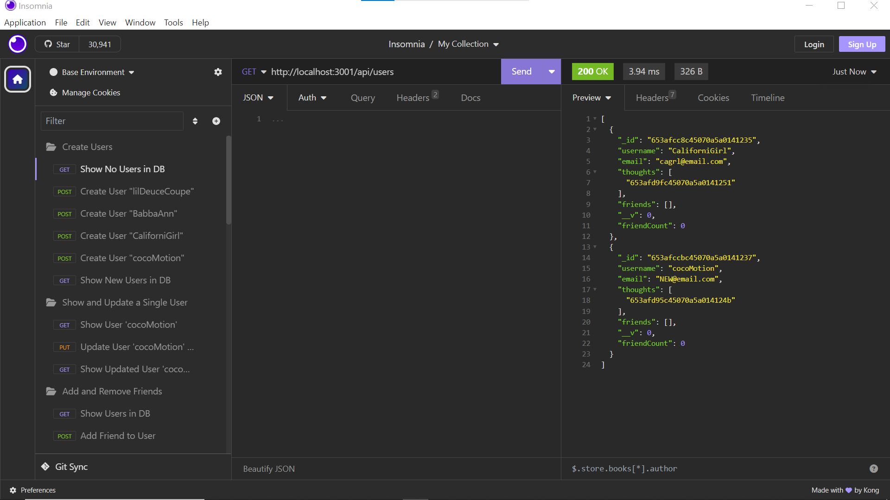
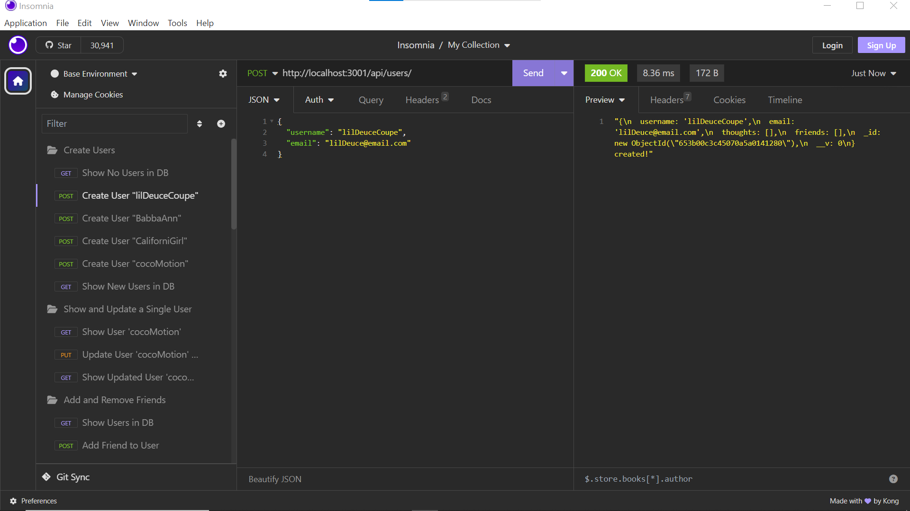
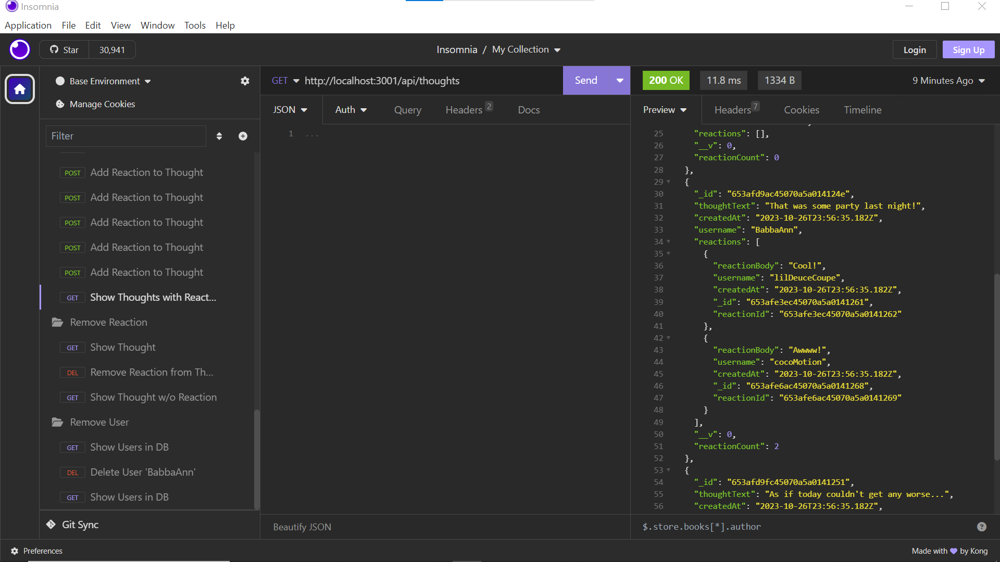

# NoSQL-Social-Network

## Description
The purpose of this project is to build an API for a social network web application where users can share their thoughts, react to friends’ thoughts, and create a friend list. This project utilizes Node.js, Express, MongoDB, and Mongoose ORM. This is a "backend only" project. All routes will be tested for proper functionaility using Insomnia. Acceptance Criteria have been broken down into individual features (e.g. AC01). For details on the implementation, review the applicable 'Usage' section of this README.

### User Story

* AS A social media startup
>    -	I WANT an API for my social network that uses a NoSQL database
SO THAT my website can handle large amounts of unstructured data

### Acceptance Criteria

>* GIVEN a social network API

>* AC01: Application Launch
>    -	WHEN I enter the command to invoke the application
>    -	THEN my server is started and the Mongoose models are synced to the MongoDB database

>* AC02: Homepage Option
>    -	WHEN I open API GET routes in Insomnia for users and thoughts
>    -	THEN the data for each of these routes is displayed in a formatted JSON

>* AC03: Login/Sign-in Prompt
>    -	WHEN I test API POST, PUT, and DELETE routes in Insomnia
>    -	THEN I am able to successfully create, update, and delete users and thoughts in my database

>* AC04: Sign Up Form
>    -	WHEN I test API POST and DELETE routes in Insomnia
>    -	THEN I am able to successfully create and delete reactions to thoughts and add and remove friends to a user’s friend list

## Installation

> * To watch a video demostrating the full functionality of the application, open the browser and paste the following URL in the address bar, or click on the link: https://watch.screencastify.com/v/tvBIrl4Ir9KbS0vqILVO
> * To access the project repo, open the browser and paste the following URL in the address bar, or click on the link: https://github.com/recenasu/NoSQL-Social-Network

## Usage

>    -	To launch the application, open the project in VSCode.
>    -	Right click on the root directory and select 'Open Integrated Terminal' and set the terminal to use the Bash script
>    -	At the command line, type 'npm start'
>    -	The server has started and is ready if no errors are received and the following message is displayed in the terminal: "API server for ...\NoSQL-Social-Network running on port 3001!"

> * The following screens show sample CRUD interactions with the application using Insomnia. For a full demonstration, refer to the video at  https://watch.screencastify.com/v/tvBIrl4Ir9KbS0vqILVO

> * Screen 1

> * Screen2

> * Screen 3

## Database Models

**User**:

* `username`
  * String
  * Unique
  * Required
  * Trimmed

* `email`
  * String
  * Required
  * Unique
  * Must match a valid email address 

* `thoughts`
  * Array of `_id` values referencing the `Thought` model

* `friends`
  * Array of `_id` values referencing the `User` model (self-reference)

**Schema Settings**:

Virtual called `friendCount` that retrieves the length of the user's `friends` array field on query.

---

**Thought**:

* `thoughtText`
  * String
  * Required
  * Must be between 1 and 280 characters

* `createdAt`
  * Date
  * Set default value to the current timestamp
  * getter method to format the timestamp on query

* `username` (The user that created this thought)
  * String
  * Required

* `reactions` (These are like replies)
  * Array of nested documents created with the `reactionSchema`

**Schema Settings**:

Virtual called `reactionCount` that retrieves the length of the thought's `reactions` array field on query.

---

**Reaction** (SCHEMA ONLY)

* `reactionId`
  * Use Mongoose's ObjectId data type
  * Default value is set to a new ObjectId

* `reactionBody`
  * String
  * Required
  * 280 character maximum

* `username`
  * String
  * Required

* `createdAt`
  * Date
  * Set default value to the current timestamp
  * getter method to format the timestamp on query

**Schema Settings**:

This will not be a model, but rather will be used as the `reaction` field's subdocument schema in the `Thought` model.

### API Routes

**`/api/users`**

* `GET` all users

* `GET` a single user by its `_id` and populated thought and friend data

* `POST` a new user:

* `PUT` to update a user by its `_id`

* `DELETE` to remove user by its `_id`

**BONUS**: Remove a user's associated thoughts when deleted.

---

**`/api/users/:userId/friends/:friendId`**

* `POST` to add a new friend to a user's friend list

* `DELETE` to remove a friend from a user's friend list

---

**`/api/thoughts`**

* `GET` to get all thoughts

* `GET` to get a single thought by its `_id`

* `POST` to create a new thought (don't forget to push the created thought's `_id` to the associated user's `thoughts` array field)

* `PUT` to update a thought by its `_id`

* `DELETE` to remove a thought by its `_id`

---

**`/api/thoughts/:thoughtId/reactions`**

* `POST` to create a reaction stored in a single thought's `reactions` array field

* `DELETE` to pull and remove a reaction by the reaction's `reactionId` value

## Credits

> * npm express v4.17.1 module was used for managing API routes.
> * npm mongoose v7.0.2 module was used for database connectivity.
> * refer to package.json for these and any other dependencies.

